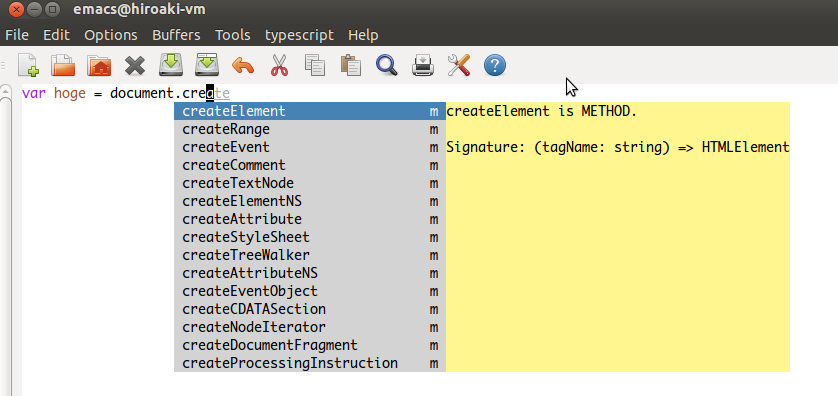
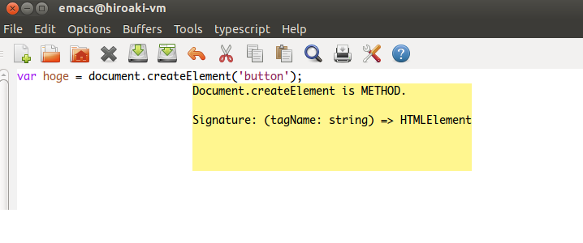
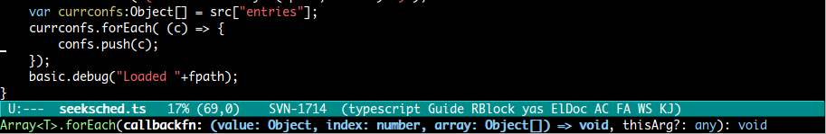
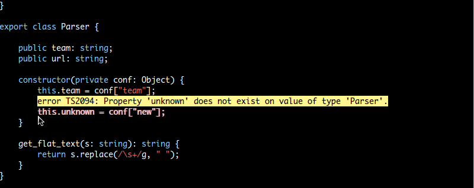
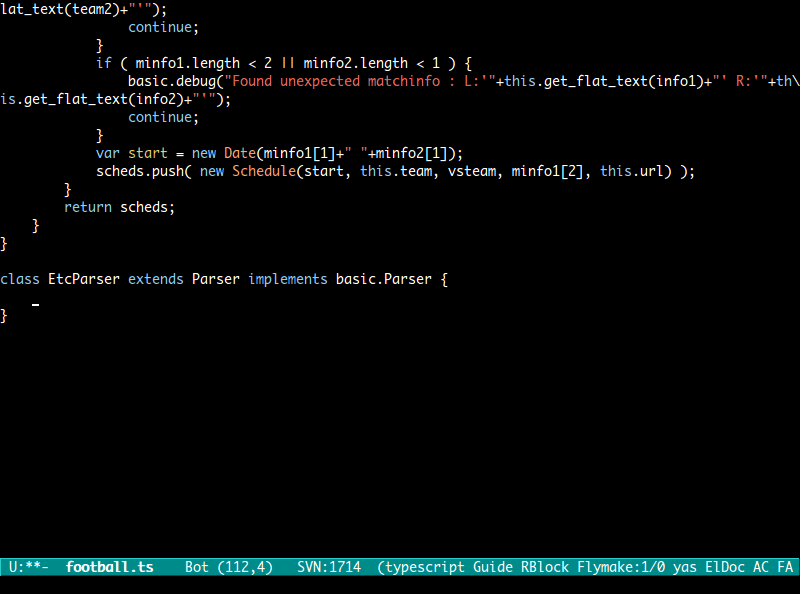
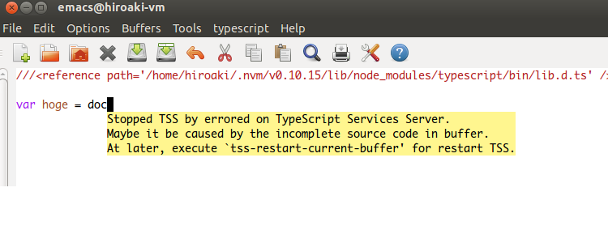

[](https://travis-ci.org/aki2o/emacs-tss)

# これは何？

Emacsでtypescript-mode時に、typescript-toolsを使用した入力補完/文法チェックを提供するEmacsの拡張です。  

typescript-toolsについては、以下を参照して下さい。  
<https://github.com/clausreinke/typescript-tools>

# 特徴

### auto-complete.elによる入力補完



### popup.elによるヘルプ表示



### eldoc.elによるメソッドシグネチャ表示



### flymake.elによる文法チェック



### 定義元ジャンプ

### 継承定義の自動入力



# Emacs以外に必要なもの

-   

# インストール

### package.elを使う場合

2013/09/10 melpaリポジトリからインストール可能  

### el-get.elを使う場合

2013/08/10 と言いつつ、まだ利用できません。  
2013/09/08 利用可能。ただし、masterブランチのみです。  

### auto-install.elを使う場合

```lisp
(auto-install-from-url "https://raw.github.com/aki2o/emacs-tss/master/tss.el")
(auto-install-from-url "https://raw.github.com/aki2o/emacs-tss/master/typescript.el")
```
-   下記の依存拡張もそれぞれインストールする必要があります

### 手動の場合

tss.elをダウンロードし、load-pathの通った場所に配置して下さい。
-   下記の依存拡張もそれぞれインストールする必要があります

### 依存拡張

-   
-   
-   
-   

### オリジナルのTypeScript.elについて

Typescript編集のための拡張が、  から提供されていますが、
エラーになる箇所や、フックが定義されていないといった問題点があるため、
修正したものをtypescript.elとして同梱しています。

### オリジナル版からの修正情報

```
$ diff TypeScript.el typescript.el
66c66
< (declare-function ido-mode "ido" ())
---
> (declare-function ido-mode "ido")
486a487,491
> (defcustom typescript-mode-hook nil
>   "*Hook called by `typescript-mode'."
>   :type 'hook
>   :group 'typescript)
> 
3351c3356,3358
<     (font-lock-fontify-buffer)))
---
>     (font-lock-fontify-buffer))
> 
>   (run-mode-hooks 'typescript-mode-hook))
```
-   オリジナル版の更新状況が同梱版に反映されていないこともあるかも知れません
-   反映の最終確認日は、2013/08/10です

# 設定

```lisp
;; 同梱されたtypescript.elを使う場合
(require 'typescript)
(add-to-list 'auto-mode-alist '("\\.ts\\'" . typescript-mode))

(require 'tss)

;; キーバインド
(setq tss-popup-help-key "C-:")
(setq tss-jump-to-definition-key "C->")
(setq tss-implement-definition-key "C-c i")

;; 必要に応じて適宜カスタマイズして下さい。以下のS式を評価することで項目についての情報が得られます。
;; (customize-group "tss")

;; 推奨設定を行う
(tss-config-default)
```

# 留意事項

### 有効化

以下の条件を満たしている場合は、自動で有効になるため気にする必要はありません。  
-   同梱されたtypescript.elを使っている
-   `tss-config-default` を実施している

それ以外の場合は、自動で有効にならないので、M-x `tss-setup-current-buffer` として下さい。  

-   `tss-enable-modes` のモード以外のバッファでは有効にはなりません

### 解析不能による無効化

本拡張の提供する入力補完/文法チェックなどの機能は、typescript-toolsに依存しており、  
バッファの内容によっては、typescript-toolsの解析機能が不能になる場合があるようです。  
もし、そうなった場合、タイムアウトにより本拡張の処理が非常に遅くなってしまうため、  
以下のようにポップアップを表示し、自動で本拡張を無効化します。  



解析不能な状態になる原因はバッファの内容にあるため、  
バッファを変更すれば本拡張を再度有効にしても正常に動作するかも知れません。  
M-x `tss-restart-current-buffer` とすることで、本拡張を再度有効にすることができます。  

また、もし本拡張を停止させたい場合には、M-x `tss-stop-current-buffer` して下さい。  

### 参照ファイルの更新内容の反映

Typescriptでは参照などにより、外部ファイルの機能を利用することが可能ですが、  
外部ファイルが更新されても、現在編集中のバッファには自動では反映されません。  
編集中のバッファから参照しているファイル内の定義が変更された場合、  
それを反映させるには、 M-x `tss-reload-current-project` として下さい。  

# 動作確認

-   Emacs &#x2026; GNU Emacs 23.3.1 (i386-mingw-nt5.1.2600) of 2011-08-15 on GNUPACK
-   typescript-tools &#x2026; master branch
-   auto-complete.el &#x2026; 1.4.0
-   json-mode.el &#x2026; 1.1.0
-   log4e.el &#x2026; 0.2.0
-   yaxception.el &#x2026; 0.1

**Enjoy!!!**
