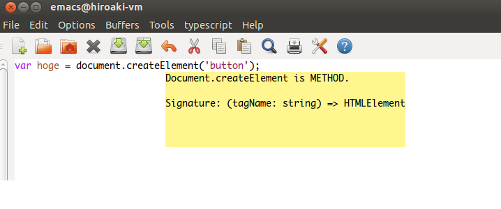

[Japanese](https://github.com/aki2o/emacs-tss/blob/master/README-ja.md)

What's this?
============

This is a extension of Emacs that provides completion/syntax-check by using typescript-tools in typescrript-mode.

About typescript-tools, see https://github.com/clausreinke/typescript-tools


Feature
=======

* **Auto completion by auto-complete.el**


* **Popup help by popup.el**



* **Jump to definition**

* **Check syntax by flymake.el**


Requirement
===========

* [typescript-tools](https://github.com/clausreinke/typescript-tools)


Install
=======

I recommend using el-get for installing this extension.  
Downloading manually or using auto-install.el are OK,
but installing each the following dependency is required in this case.

### If use el-get.el

2013/08/10 Not yet available.  

If you set `el-get-sources` in your .emacs or site-start.el file,  
You can available el-get to install this extension.

    (setq el-get-sources
          '(
            (:name log4e
                   :website "https://github.com/aki2o/log4e"
                   :description "provide logging framework for elisp."
                   :type github
                   :pkgname "aki2o/log4e")
            (:name yaxception
                   :website "https://github.com/aki2o/yaxception"
                   :description "provide framework about exception like Java for elisp."
                   :type github
                   :pkgname "aki2o/yaxception")
            (:name tss
                   :website "https://github.com/aki2o/emacs-tss"
                   :description "provide a interface for auto-complete.el/flymake.el on typescript-mode."
                   :type github
                   :pkgname "aki2o/emacs-tss"
                   :depends (auto-complete log4e yaxception))
            ))
    
### If use auto-install.el

    (auto-install-from-url "https://raw.github.com/aki2o/emacs-tss/master/tss.el")
    (auto-install-from-url "https://raw.github.com/aki2o/emacs-tss/master/typescript.el")

### Dependency

* [auto-complete.el](https://github.com/auto-complete/auto-complete)
* [log4e.el](https://github.com/aki2o/log4e)
* [yaxception.el](https://github.com/aki2o/yaxception)

### About official TypeScript.el

[The official site](http://www.typescriptlang.org/) provides TypeScript.el for Emacs.  
But the official Typescript.el has some trouble ( wrong syntax, have no hook ).  
So, bundle typescript.el as modified version of the official TypeScript.el.  

#### Modification from the official version

    $ diff TypeScript.el typescript.el
    66c66
    < (declare-function ido-mode "ido" ())
    ---
    > (declare-function ido-mode "ido")
    486a487,491
    > (defcustom typescript-mode-hook nil
    >   "*Hook called by `typescript-mode'."
    >   :type 'hook
    >   :group 'typescript)
    > 
    3351c3356,3358
    <     (font-lock-fontify-buffer)))
    ---
    >     (font-lock-fontify-buffer))
    > 
    >   (run-mode-hooks 'typescript-mode-hook))

**Note:** It maybe happen that update of the official version is not merged into typescript.el.  
**Note:** The last date of checking merge is 2013/08/10.  


Configuration
=============

### If use bundled typescript.el

```lisp
(require 'typescript)
(add-to-list 'auto-mode-alist '("\\.ts\\'" . typescript-mode))
(require 'tss)
(add-hook 'typescript-mode-hook 'tss-setup t)
(setq tss-popup-help-key "C-:")
(setq tss-jump-to-definition-key "C->")
```

### If use official TypeScript.el

```lisp
(require 'tss)
(setq tss-popup-help-key "C-:")
(setq tss-jump-to-definition-key "C->")
```


Attention
=========

### Activation

If use bundled typescript.el, do not need to do anything.  
If use official TypeScript.el, need M-x tss-setup for activation in typescript-mode.  

### Deactivation by trouble at typescript-tools

The function of this extension depends on typescript-tools.  
And, typescript-tools may become impossible depending on the contents of the buffer.  
If it happened, For avoiding Emacs performance degradation,  
this extention is deactivated automatically and the following popup notification is shown.


The above case is caused by the contents of the buffer.  
So, typescript-tools maybe back to normal by activation after editing of the buffer.  
If you want to activate this extension again, do M-x tss-restart-current-buffer.

### Limiting the number of completion candidate

For using auto-complete.el, this extension parse JSON data got from typesctipt-tools.  
And, freeze may be caused by parsing large JSON data.  
So, this extension limit the size of JSON data got from typescript-tools.  

On completion, user can narrow the completion candidate by C-s.  
In the situation, it maybe happen that the candidate should be shown but not shown.  
If it happend, the candidate will be shown by typing subsequent character probably.  

----

#### 2013/08/10

For limiting the size of JSON data, need modifying typescript-tools.  
I made modified version of typescript-tools. It's https://github.com/aki2o/typescript-tools  
Now, I'm requesting the original typescript-tools merge my modified version.  

If freeze happend and you want to avoid it, do the following.

1. Get [modified version tss.ts](https://raw.github.com/aki2o/typescript-tools/maxresponses/tss.ts).
2. Do compile original typescript-tools seeing README and replacing tss.ts with the modified.
3. Do install.

----

### Reflection of modified other file

In Typescript, can import definition of other file using `///<reference path='...'>` and so on.  
But, this extension can not notice update of them automatically.  
If you want to reflect update of them into current buffer, do M-x tss-reload-current-project.


Tested On
=========

* Emacs ... GNU Emacs 23.3.1 (i386-mingw-nt5.1.2600) of 2011-08-15 on GNUPACK
* auto-complete.el ... 1.4.0
* log4e.el ... 0.1
* yaxception.el ... 0.1


**Enjoy!!!**

