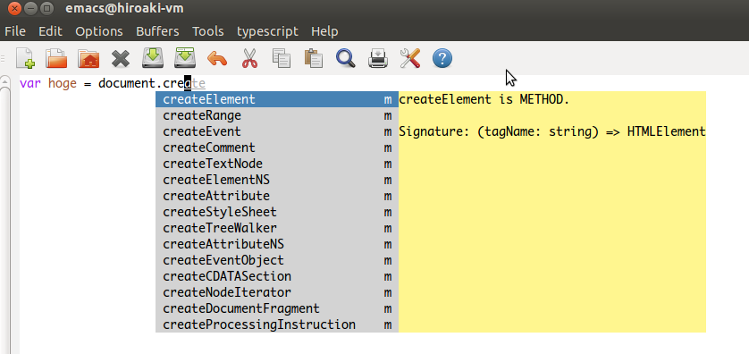
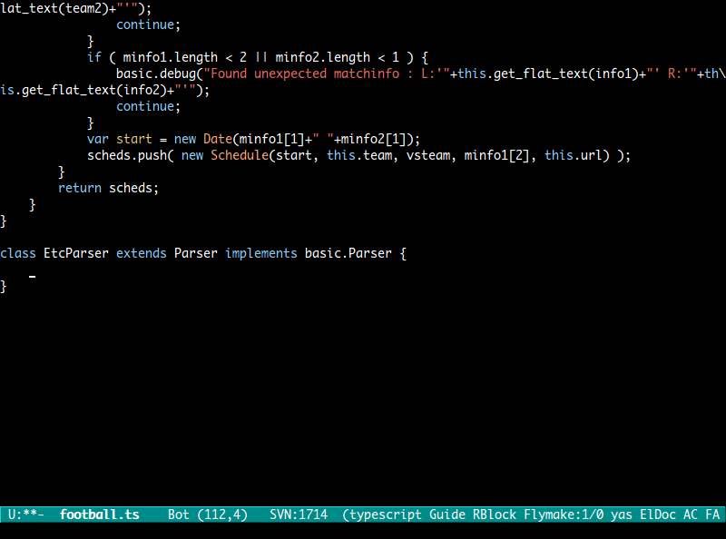
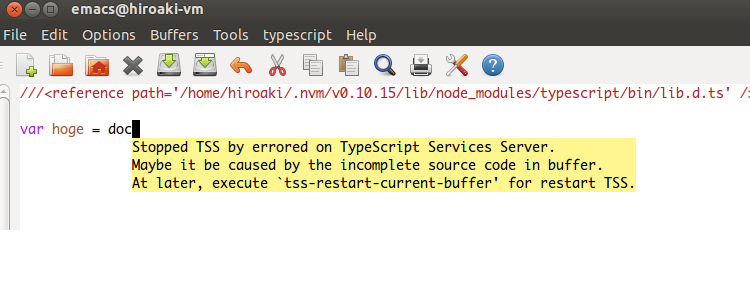

[](https://travis-ci.org/aki2o/emacs-tss)

# What's this?

This is a extension of Emacs that provides completion/syntax-check by using typescript-tools in typescrript-mode.  

About typescript-tools, see <https://github.com/clausreinke/typescript-tools>

# Feature

### Auto completion by auto-complete.el



### Popup help by popup.el


### Echo method signature by eldoc.el


### Check syntax by flymake.el


### Jump to definition

### Implement inherit definition



# Requirement

-   

# Install

### If use package.el

2013/09/10 It's available by using melpa.  

### If use el-get.el

2013/08/10 Not yet available.  
2013/09/08 It's available. But, master branch only.  

### If use auto-install.el

```lisp
(auto-install-from-url "https://raw.github.com/aki2o/emacs-tss/master/tss.el")
(auto-install-from-url "https://raw.github.com/aki2o/emacs-tss/master/typescript.el")
```
-   In this case, you need to install each of the following dependency.

### Manually

Download tss.el and put it on your load-path.  
-   In this case, you need to install each of the following dependency.

### Dependency

-   
-   
-   
-   

### About official TypeScript.el

 provides TypeScript.el for Emacs.  
But the official Typescript.el has some trouble ( wrong syntax, have no hook ).  
So, I have bundled typescript.el as modified version of the official TypeScript.el.

### Modification from the official version

```
$ diff TypeScript.el typescript.el
66c66
< (declare-function ido-mode "ido" ())
---
> (declare-function ido-mode "ido")
486a487,491
> (defcustom typescript-mode-hook nil
>   "*Hook called by `typescript-mode'."
>   :type 'hook
>   :group 'typescript)
> 
3351c3356,3358
<     (font-lock-fontify-buffer)))
---
>     (font-lock-fontify-buffer))
> 
>   (run-mode-hooks 'typescript-mode-hook))
```
-   It maybe happen that update of the official version is not merged into typescript.el
-   The last date of checking merge is 2013/08/10

# Configuration

```lisp
;; If use bundled typescript.el,
(require 'typescript)
(add-to-list 'auto-mode-alist '("\\.ts\\'" . typescript-mode))

(require 'tss)

;; Key binding
(setq tss-popup-help-key "C-:")
(setq tss-jump-to-definition-key "C->")
(setq tss-implement-definition-key "C-c i")

;; Make config suit for you. About the config item, eval the following sexp.
;; (customize-group "tss")

;; Do setting recommemded configuration
(tss-config-default)
```

# Consideration

### Activation

If you meet the following condition, do not need to do anything.  
-   use bundled typescript.el
-   use `tss-config-default` setting

Otherwise, need M-x `tss-setup-current-buffer` for activation in typescript-mode.  

-   Not activate on the buffer of the mode not included in `tss-enable-modes`

### Deactivation by trouble at typescript-tools

The function of this extension depends on typescript-tools.  
And, typescript-tools may become impossible depending on the contents of the buffer.  
If it happened, For avoiding Emacs performance degradation,  
this extention is deactivated automatically and the following popup notification is shown.  



The above case is caused by the contents of the buffer.  
So, typescript-tools maybe back to normal by activation after editing of the buffer.  
If you want to activate this extension again, do M-x `tss-restart-current-buffer`.  

Also, if you want to stop to use typescript-tools, do M-x `tss-stop-current-buffer`.

### Reflection of the update of referenced path

You can get the external definition using `/// <reference path ...`.  
But typescript-tools can not find the update of that.  
You have to do M-x `tss-reload-current-project`
if you updated the external definition of current buffer.  

# Tested On

-   Emacs &#x2026; GNU Emacs 23.3.1 (i386-mingw-nt5.1.2600) of 2011-08-15 on GNUPACK
-   typescript-tools &#x2026; master branch
-   auto-complete.el &#x2026; 1.4.0
-   json-mode.el &#x2026; 1.1.0
-   log4e.el &#x2026; 0.2.0
-   yaxception.el &#x2026; 0.2.0

**Enjoy!!!**
